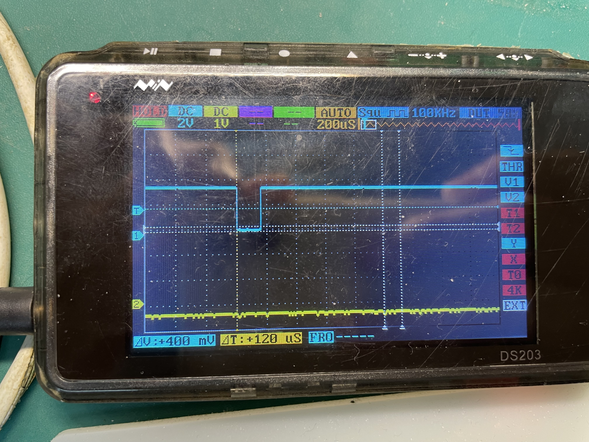
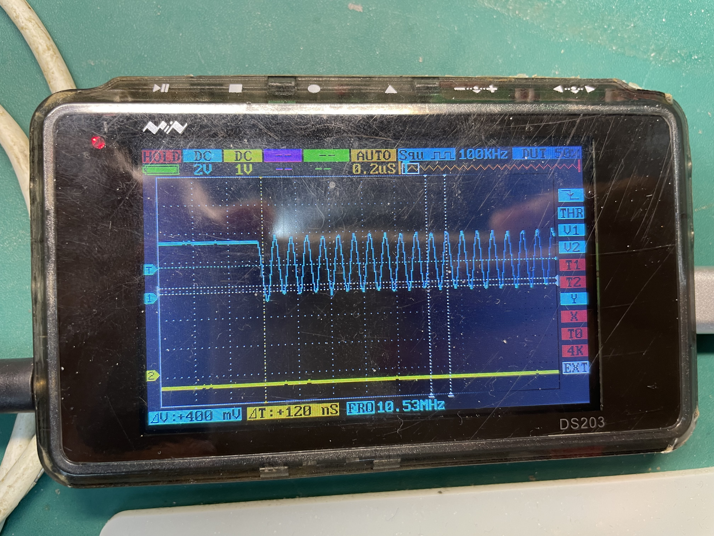
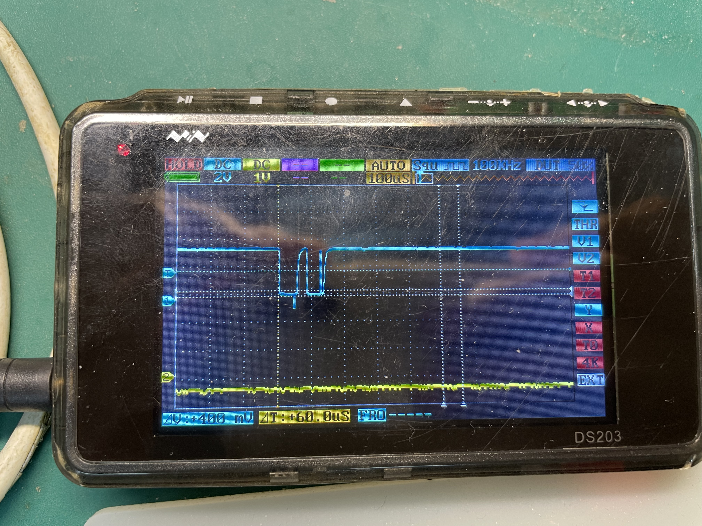
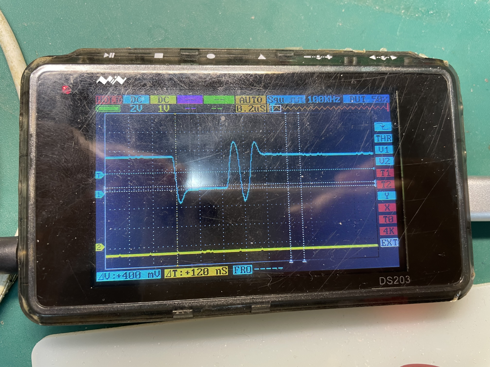
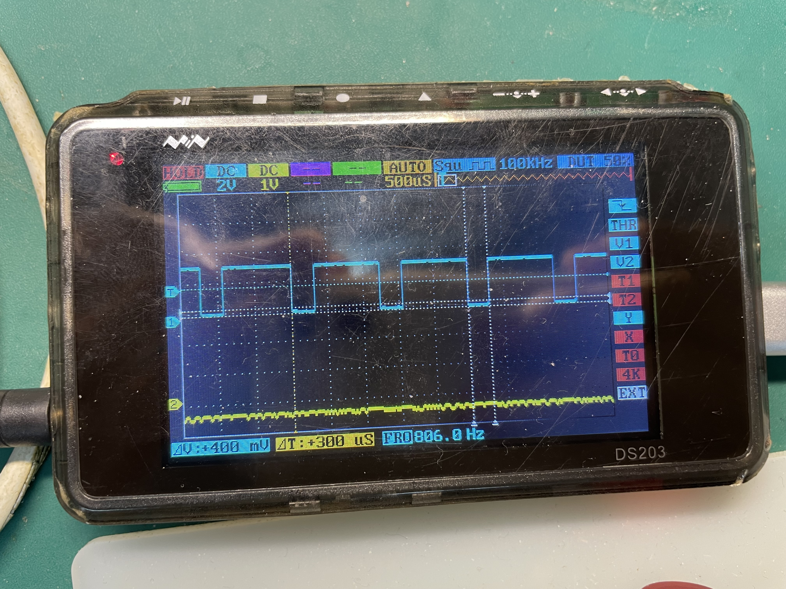
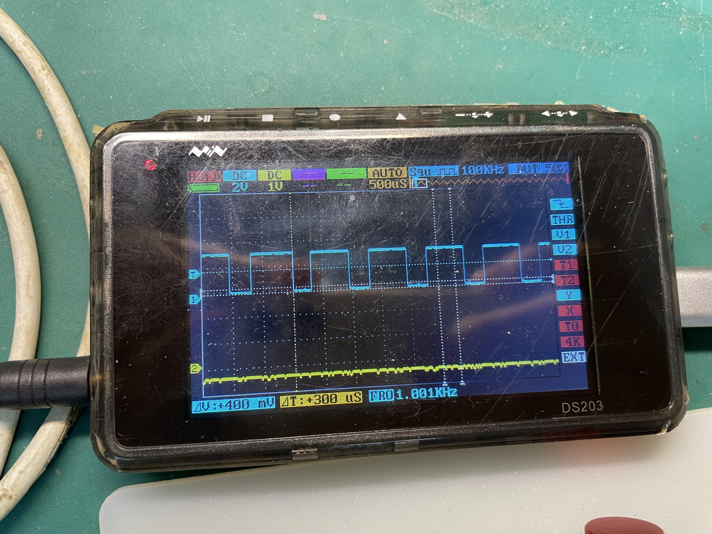
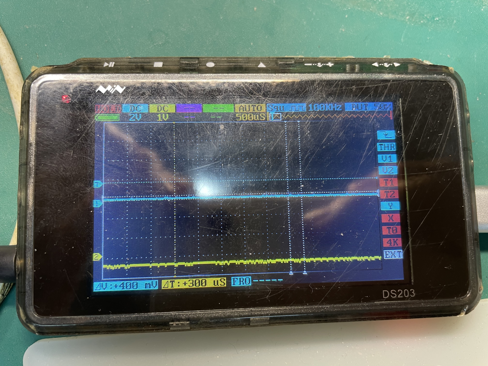

## 11.26.20：39

init已经跑通， 但是BMI088的中断回调一直不触发， 现波形如下：

CS1_Accel在init阶段有这个波形， 后续没有

SCK正常

MISO正常

MOSI正常

INT1_Accel正常

INT1_Gyro正常

CS1_Gyro一直为低

## 12.1.11：24

如果在HAL_CAN_RxFifo0MsgPendingCallback中没有switch那个id， 是不会进中断的。